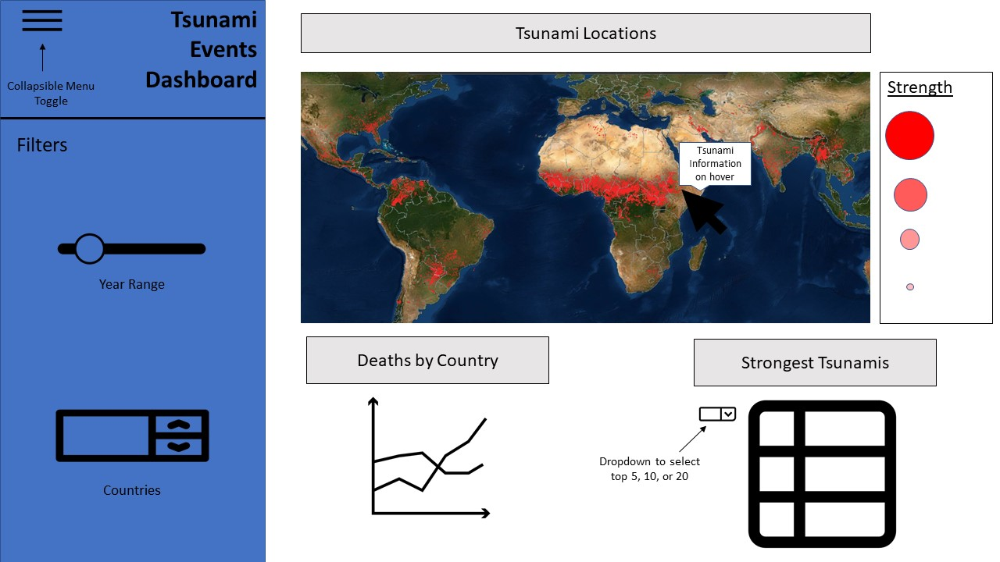

# Tsunami Events Dashboard (Python)

## Accessing the App via Heroku

Link to Heroku app: [tsunami-events-dashboard](https://dashboard.heroku.com/apps/tsunami-events-dashboard)

## Description of the App Interface

This app contains a landing page with three tiles: an interactive geographical map that users can pan across to see the location of each tsunami as well as its strength, a time series graph showing the number of deaths by country, and a table listing the strongest tsunamis. The tsunami events data underlying the three plots is filtered for using a collapsible menu that contains two widgets: a slider to select a range of years of occurrence, and a drop-down menu to filter for countries impacted. The geographical map makes use of the tsunami latitude and longitude location data, generates a heat map to indicate tsunami magnitude, and allows users to hover over tsunami events plotted on the map to glean more comprehensive event details. Users can also peruse of a table listing the strongest tsunami events per the year and country selection applied, with the option to select from among a display of the top 5, 10 , 20 strongest events. Lastly, the time series graph shows the number of deaths by country per the year and country selection applied.

## Proposal

Our proposal can be found via this link: [proposal](docs/proposal.md)

## Dashboard Sketch

## Accessing the App Locally

To run and explore the app locally, first clone the git repo, create and activate a local environment, and install dependencies:

    git clone https://github.com/UBC-MDS/tsunami-events-dashboard-python.git

    # mac
    virtualenv venv
    source venv/bin/activate
    # Windows
    venv\Scripts\activate
    # Or Linux
    source venv/bin/activate

    pip install -r requirements.txt

Then, run the app:

    python src/app.py

## Built with

-   [Dash](https://dash.plot.ly/) - Main server and interactive components
-   [Altair](https://altair-viz.github.io/index.html) - Used to generate interactive plots, using Python
-   [Pandas](https://pandas.pydata.org/) - Used for data wrangling and pre-processing

## Contributing

| Contributors         | Github                |
|----------------------|-----------------------|
| Gautham Pughazhendhi | \@gauthampughazhendhi |
| Jacqueline Chong     | \@Jacq4nn             |
| Rowan Sivanandam     | \@Rowansiv            |
| Vadim Taskaev        | \@vtaskaev1           |

## License

